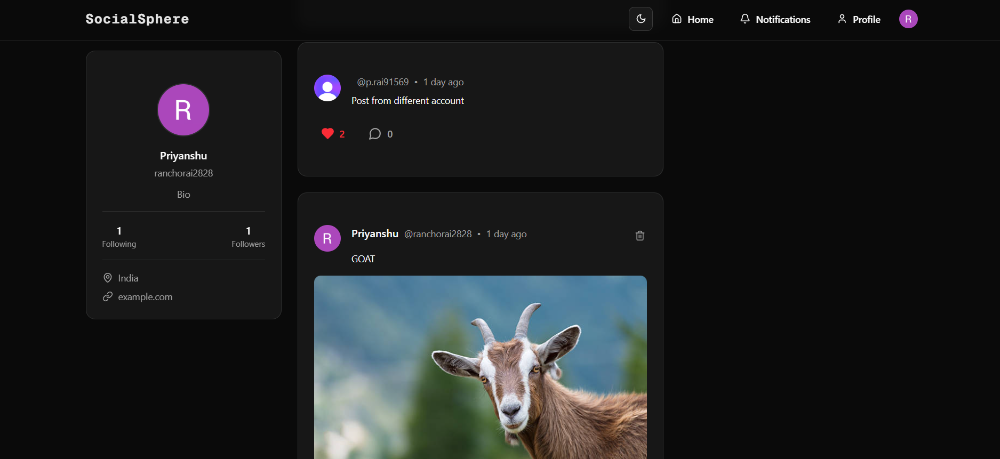
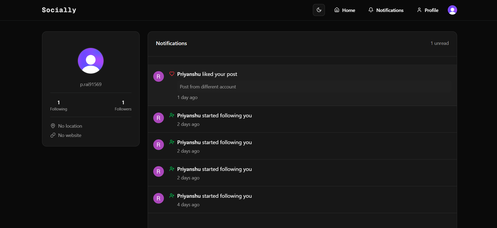
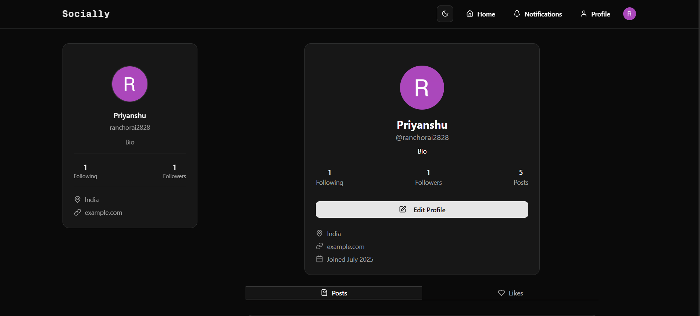
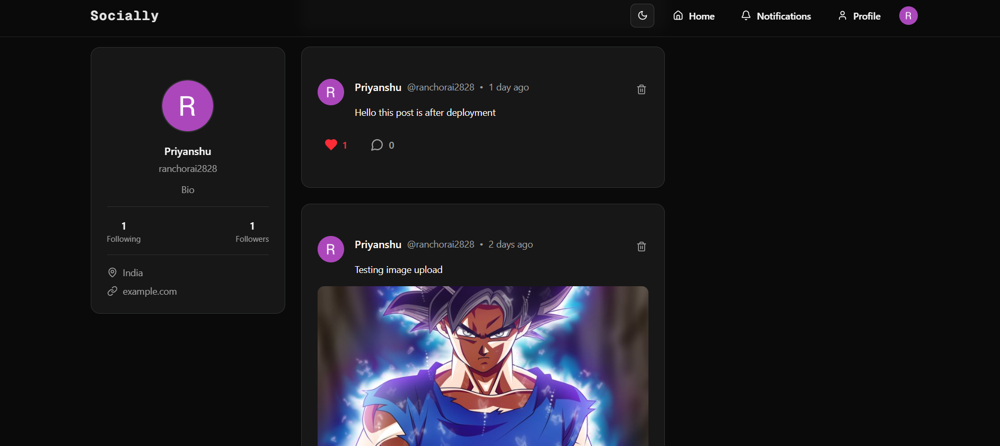

# 📱 SocialSphere - A Modern Social Media Platform



**SocialSphere** is a dynamic, full-stack social media application built to connect people through posts, likes, comments, and more. With a sleek interface, robust authentication, and seamless data handling, SocialSphere offers a modern social networking experience.

## 🚀 Features

### ✨ Core Functionality
- Create, edit, and delete posts with text and media
- Like and comment on posts
- Follow/unfollow users
- Real-time feed updates with optimistic UI updates
- Responsive design for mobile and desktop

### 🔒 Authentication & Authorization
- Secure user authentication with Clerk
- Role-based access control for protected routes
- Seamless session management

### 📤 Media & File Handling
- File uploads powered by UploadThing
- Support for images and other media in posts
- Optimized media storage and retrieval

### ⚡ Performance & Optimization
- Server-side rendering with Next.js App Router
- Efficient data fetching with caching and revalidation
- Client and server component integration
- Special Next.js files: `loading.tsx`, `error.tsx`, `not-found.tsx`

### 🎨 Styling
- Modern UI with Tailwind CSS and Shadcn components
- Smooth animations and transitions
- Dark and light theme support

### 🗃️ Data Management
- PostgreSQL database with Prisma ORM
- Dynamic and static route handling
- API integration via Next.js Route Handlers
- Server Actions for form submissions and mutations

## 🖥️ Screenshots






## 🛠️ Tech Stack

### 🔧 Frontend
- Next.js (App Router)
- TypeScript
- Tailwind CSS + Shadcn
- Client & Server Components
- React Hooks

### 🖥️ Backend
- PostgreSQL
- Prisma ORM
- Next.js Route Handlers
- Server Actions

### 🔐 Authentication
- Clerk for user authentication and session management

### 📡 File Storage
- UploadThing for media uploads

## 🌐 Live Demo

🚀 [SocialSphere Live](https://social-app-next-js-sage.vercel.app/)  
*(Hosted on Vercel — blazing fast and always available)*

## 📦 Installation

### ⚙️ Prerequisites
- Node.js (v18+)
- PostgreSQL (local or hosted)
- Clerk account for authentication
- UploadThing account for file uploads
- Git

### 📁 Clone the Repository
```bash
git clone https://github.com/Priyanshu-010/Social-App-Next-js
cd Social-App-Next-js
```

### 🔧 Setup
1. Install dependencies:
```bash
npm install
```

2. Create a `.env.local` file in the root directory and add:
```bash
DATABASE_URL=your_postgres_connection_string
CLERK_SECRET_KEY=your_clerk_secret_key
UPLOADTHING_SECRET=your_uploadthing_secret
NEXT_PUBLIC_CLERK_PUBLISHABLE_KEY=your_clerk_publishable_key
```

3. Set up the database:
```bash
npx prisma migrate dev
```

4. Run the development server:
```bash
npm run dev
```

Open [http://localhost:3000](http://localhost:3000) to view the app in your browser.

## 👤 About the Developer

**Priyanshu Rai**  
📧 [priyanshurai2772@gmail.com](mailto:priyanshurai2772@gmail.com)  
🔗 [LinkedIn](https://www.linkedin.com/in/priyanshuraidev/)  
💻 [GitHub](https://github.com/Priyanshu-010)

## 📜 License

This project is licensed under the MIT License - see the [LICENSE](LICENSE) file for details.
```